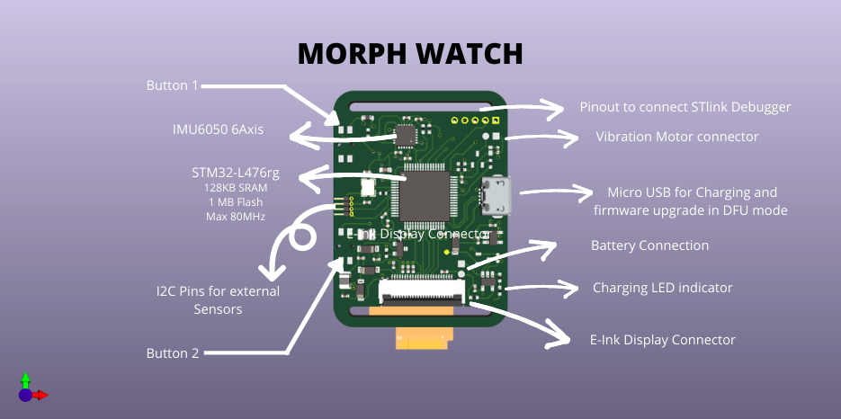

# MorphWatch-STM32

# Description
Morph watch is a wearable made for makers and hackers who want to do more with  their devices and want to have control over their data. As a normal functional device it shows time, date and no of steps,weather data . But it is more than that it can be used to run machine learning algorithums on 6 Axis IMU MPU6050 data to detect gestures. The small form factor and integrated battery also allows the user to attach the watch to a target lets say attach it to your bicycle to gather the vibration data, or attach it to a machine to gather the vibration data to  train a model for predicting breakdown and service durations. The device also  provides I2C interface to attach more sensorS as modules. It also provides interface  to connect with  STLINK-V2 and supports full debugging features using breakpoints and print statements. The watch is intended to have 2 Modes:

- Ultra Low Power Mode : In this mode the L476RG controller  wakes up ever 1 minute to update the minutes and then sleeps. The 2 buttons are configures as external intruppts and can be pressed to wake up the controller and do other tasks like going though the Menu and getting the status of external senors or IMU data. This mode should give very long battery life

- Normal Mode: In this mode the microcontroller is active all the time and can count steps and perform machine learning algorithums.

## <u>Features supported by Hardware</u>
Morph Watch has STM32-L476RG at its heart which has 128KB SRAM and 1MB Flash suitable for running Edge AI models. It has internal RTC and DFU support which allows updating the firmware over USB without any external USB to Serial convertor or Programmer. The watch has 2 buttons to navigate menu or work as external interrupts. The battary can be charegd using the onboard charging IC.The battery status can be monitored and diplayed on the Eink display. A 9 Axis IMU is onboard which allows user to create innovative projects. A vibration moter can be connected to get vibration feedback. A Bluetooth module JDY08 based on TI's CC2541 Chip allows user to connect to Android device over bluetooth 4.0. Diagram Below shoews the board and placement of  key components.

 

  

## <u>Schematic</u>

## <u>Uploading Code and Debugging</u>
Uploading the code is possible though USB in DFU mode by connecting the Boot Pin to HIGH  by either connecting the jumper using external wire or by shorting the jumper JP1 by soldering. To exit the DFU mode remove the jumper JP1 and powercycle. The code can also be uploaded using the Serial Wire debug interface. STlink Debugger/Programmer is need to use this interface.

## TO DO list

### Phase 1:

- [ ] Implement code to interface EINK Display using SPI protocol and control partial and complete refresh
- [ ] Implement code to interface IMU using I2C protocol and grab the raw data.
- [ ] Understanding the internal RTC functionality of L476RG and implementing code to get time and data.
- [ ] Understanding intruppts on L476RG and configuring buttons as external intruppts
- [ ] Implementing code to control the vibration motor

### Phase 2:

- [ ] Creating Menus on the Eink Display and switching between menu using buttons.
- [ ] Recognising Gestures using IMU and exploring Kalman filter 
- [ ] Understanding CRC hardware on board and implementing code to grab data. This functionality will be used to send CRC along with data to detect tempering
- [ ] Figure out a Generic app to check the functionality
- [ ] Integration of all the features to achieve functional Watch

### Phase 3:

- [ ] Understanding the Bluetooth4.0 and Write code to interface Bluetooth in transparent mode using UART
- [ ] Integration of Bluetooth functionality with other features
- [ ] Using  Bosch'S BlechC using STM HAL code.
- [ ] Exploring Low power modes of L476RG

## Story Behind : 
### A little story telling:

  Morph watch is inpired by [Watchy|SQFMI ](https://www.crowdsupply.com/sqfmi/watchy) which you can also back on crowdsource as on today 1Feb2021. For a long time i wanted to build my own smart watch which is hackable. My idea was to have a development board which is also a product in itself with certain concrete functionality and that is why i narrowed down on having a watch because i can have it on me as a watch but it can also be something else, a learning tool and its functionality can be extended by adding mods to it. 
### Why I chose what i chose
  I chose to build Morph Watch on STM32 L476RG which is based on ARM cortex M4. I have  some sort of romatisim for ARM architecture and  its not long since i have shifted from 8 bit segment to more capable 32 bit controllers which i often see in tear down of professional products, infact the Pebble watch was based on a STM32 microntroller and TI's bluetooth chip. While ESP32 with Arduino IDE are very easy to use but I now prefer more serious debugging techniques using Debugger and breakpoints which is supported on this board.

